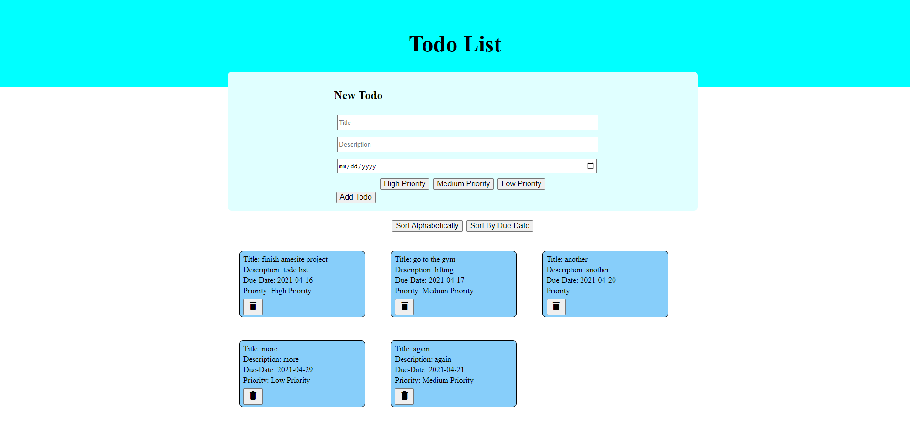

# TodoList

---

### Created By

David Martel [Github](https://github.com/davey4) | [LinkedIn](https://www.linkedin.com/in/david-martel-8117981b9/)

---

### Description

A simple todo list where the user can create and delete todos. Also assign a priority to the todo, and sort the todos alphabetically or by due date.

---

### Tech Used

- HTML / JavaScript / CSS
- Angular

---

#### Getting Started

To get a local copy up and running follow these simple steps

##### Installation

    1. fork and clone
    2. npm install in the client folder
    3. npm start in the client folder

---

    
